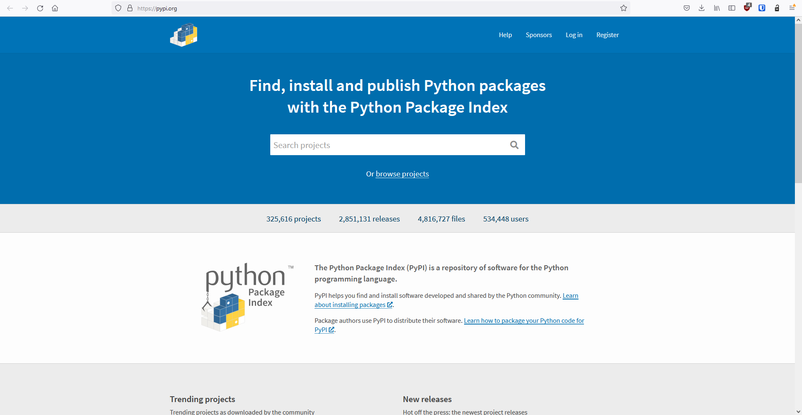
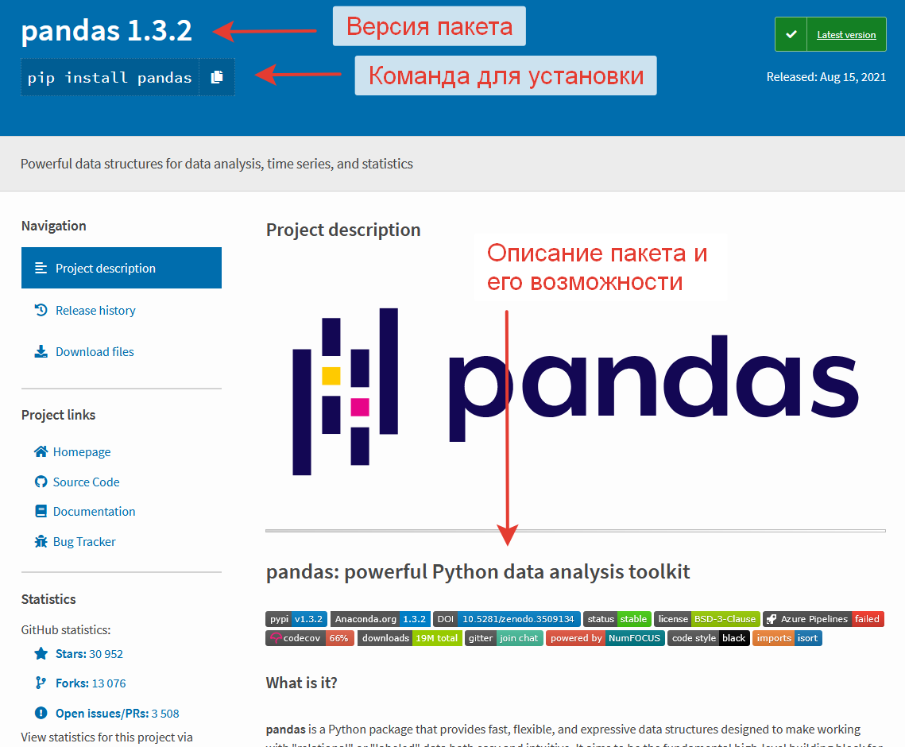

# Виртуальное окружение и установка пакетов

###### Установка дополнительных модулей и пакетов

**Python** — очень популярный язык программирования. Именно поэтому он поддерживает множество дополнительных фреймворков и  библиотек. Сторонние фреймворки устанавливаются, чтобы каждый раз не  изобретать велосипед, а пользоваться уже готовыми и проверенными  решениями. Но прежде чем установить требуемый пакет на Python, этот  программный пакет еще нужно найти. Здесь поможет центральный репозиторий Питона —[**PyPI**](https://pypi.org/), он же **Python Package Index**, он же каталог Python-пакетов.




Здесь хранится весь перечень пакетов, которые можно установить, тут же можно осуществлять поиск необходимых пакетов по их описанию.

Например, попробуем найти пакет ***<u>pandas</u>***. Вбиваем в поисковой строке ***<u>pandas**</u>* и видим результаты поиска. Переходим в описание и видим



Для установки пакета необходимо воспользоваться командой `pip install pandas`

`PIP` - команда командной строки, позволяющей инсталлировать и деинсталлировать программные пакеты **PyPI** с помощью простейшей команды `pip`. Еще PIP («пип») называют системой управления программными пакетами,  написанными на языке Python. Подразумеваются пакеты, которые находятся в центральном репозитории PyPI.

Чаще всего работа с PIP не вызывает проблем, особенно если у  пользователя уже есть опыт работы с терминалом в операционной системе  Windows, Linux, Mac.

Также стоит отметить, что для **Python серии 3.4 и выше** PIP уже установлен (installed), так как он устанавливается (installs)  по умолчанию одновременно с Python. Именно поэтому для начала надо  проверить версию Python, которая есть на компьютере. Седлать это  несложно: просто запустите в терминале следующую команду:

```
 python --version
```

Эта команда работает для Windows и Mac. Если у пользователя  установлена операционная система Linux, то команда для Python 2 будет  аналогичной, а вот для версии 3 будет немного отличаться:

```
python3 --version
```

После проверки работоспособности можно воспользоваться <u>**PIP**</u>

```
pip install package-name
```

При необходимости можно установить и **конкретную версию** интересующего пакета (а не последнюю, как это происходит по умолчанию):

```
pip install package-name==1.0.0
```

Также можно выполнить **поиск** определенного пакета:

```
pip search "your_query"
```

Или **посмотреть детали** о пакете, который уже инсталлирован:

```
pip show package-name
```

Вдобавок к этому, есть вероятность **просмотра всех инсталлированных программных пакетов**:

```
pip list
```

Удаление тоже не вызывает затруднений:

```
pip uninstall package-name
```

[]: pyenv.md	"Далее"

[]: https://otus.ru/journal/ustanovka-pip-na-python-3-bazovye-komandy/	"про PIP"
[]: https://pypi.org	"https://pypi.org"
[]: https://dataenginer.ru/?p=8348	"Инструкция по установке более подробно"

