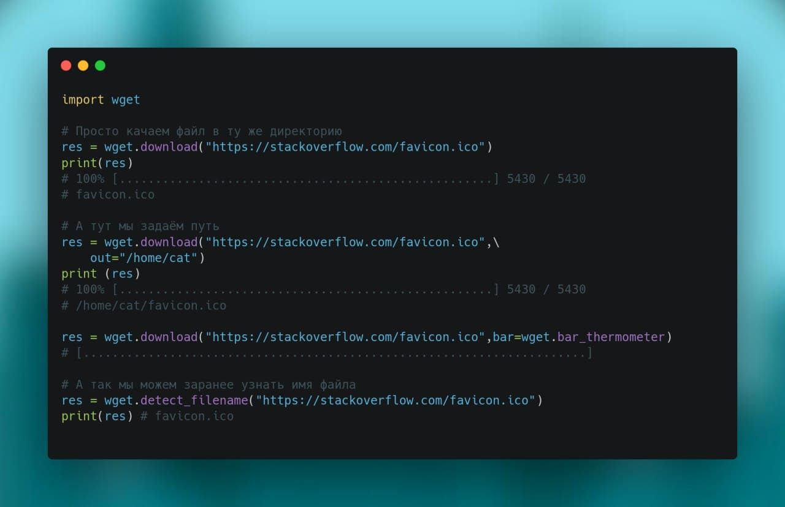

# Практическое занятие 1

1. Создать в своей папке папку с названием ***practice_1***

2. Внутри создать 2 виртуальных окружения (***venv1*** ***venv2***)

3. Установить в ***venv1*** библиотеку numpy c версией 1.21.1

4. Установить в ***venv2*** библиотеку numpy c версией 1.18.1

5. Активируйте в VSCode ***venv1***

6. Установите библиотеку ***wget***

7. С помощью библиотеки **wget** скачайте этот текстовый файл и выведите его на экран

   

   

   Дополнительное задание: скачать все изображения из папки ***image*** данного репозитория и сохранить их в папке ***images***

