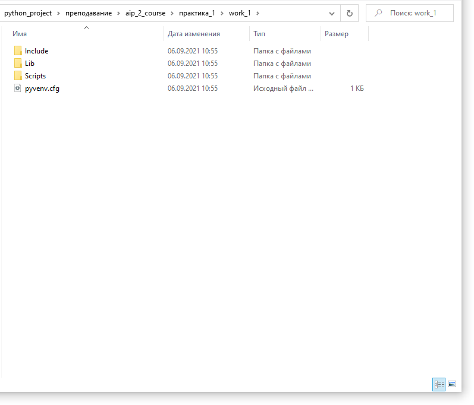
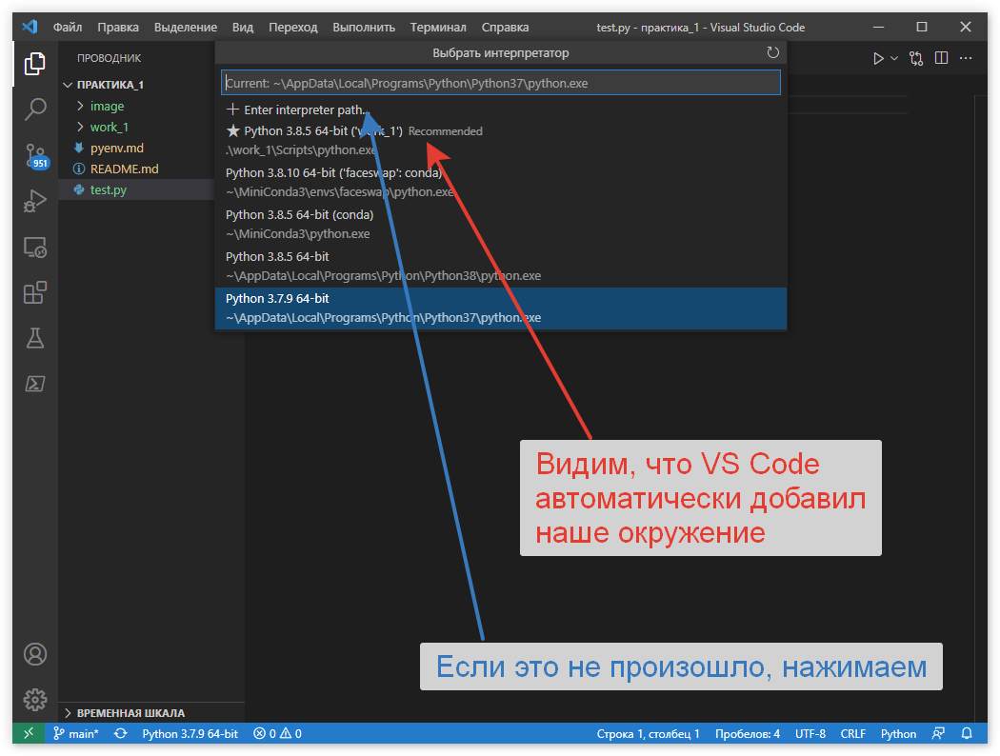

# Виртуальное окружение Python (venv)

Все сторонние пакеты устанавливаются менеджером PIP глобально. Проверить это можно просто командой `pip show <имя_пакета>`

Например, рассмотрим куда установлен пакет ***pandas***

```python
pip show pandas
```

Мы увидим следующее:


Библиотека установлена по пути `c:\users\win-server\appdata\local\programs\python\python38\lib\site-packages`

Данный путь является системным и все пакеты по умолчанию устанавливаются туда.

Это может вызвать несколько проблем:

1. различные приложения могут использовать одну и туже библиотеку, но при этом требуемые версии могут отличаться

2. может возникнуть необходимость в том,  чтобы запретить вносить изменения в приложение на уровне библиотек, т.е. вы установили приложение и хотите, чтобы оно работало независимо от  того обновляются у вас библиотеки или нет. Как вы понимаете, если оно  будет использовать библиотеки из глобального хранилища, то, со временем, могут возникнуть проблемы

3. у вас просто может не быть доступа к системному каталогу

   Для решения данных вопросов используется подход, основанный на построении виртуальных окружений – своего рода  **песочниц**, в рамках которых запускается приложение со своими  библиотеками, обновление и изменение которых не затронет другие  приложение, использующие те же библиотеки.

Для организации виртуальных окружении существует несколько библиотек, мы будет пользоваться библиотекой ***venv***.

По умолчанию данная библиотека устанавливается вместе с Python.

Для **создания** виртуального окружения, перейдите в директорию своего проекта и выполните:

```python
python -m venv venv
```

Эту команду нужно запускать в окне PoowerShell  в директории с вашим проектом. Для вызова консоли PowerShell с зажатой клавишей **Shift** нажмите правую клавишу мыши и выберите ***Открыть окно PowerShell здесь***. 

Флаг `-m` указывает Python-у запустить `venv` как исполняемый модуль. `venv/` - название виртуального окружения (где будут храниться ваши библиотеки)

В результате будет создан каталог `venv/` содержащий копию интерпретатора Python, стандартную библиотеку и другие вспомогательные файлы.

Например, создадим виртуальное окружение в папки ***Работа 1*** с именем окружения ***work_1***. Для этого переходим в папку ***Работа 1***, запускаем там окно PowerShell и выполняем команду 

```python
python -m venv work_1
```
Ждем ее завершения.

После ее завершения в папке появится дополнительная папка с названием work_1, содержащий копию интерпретатора Python, стандартную библиотеку и другие вспомогательные файлы.



### Активация

Чтобы начать пользоваться виртуальным окружением, необходимо его активировать:

- `work_1\Scripts\activate` - для Windows;
- `source work_1/bin/activate` - для Linux и MacOS:

`source` выполняет bash-скрипт без запуска дополнительного bash-процесса.

Проверить успешность активации можно по приглашению оболочки. Она будет выглядеть так:

```python
(work_1) PS D:\python_project\преподавание\aip_2_course\практика_1>
```

Теперь новые пакеты будут устанавливаться именно в это окружение и не будут влиять на основную систему.

Данное окружение нужно подключить к VS Code




Далее находим наш ***python.exe***, который расположен в папке ***work_1\Scripts*** и выбираем его.


После этого наше виртуальное окружение установлено.

[***Практическое задание***](./practiсe.md)

[https://devpractice.ru/python-lesson-17-virtual-envs/](https://devpractice.ru/python-lesson-17-virtual-envs/)

[https://pythonchik.ru/okruzhenie-i-pakety/virtualnoe-okruzhenie-python-venv](https://pythonchik.ru/okruzhenie-i-pakety/virtualnoe-okruzhenie-python-venv)


